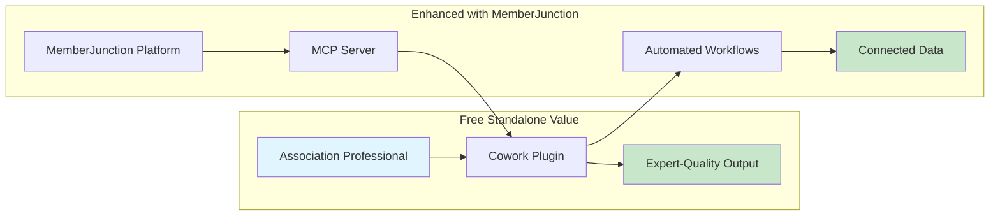
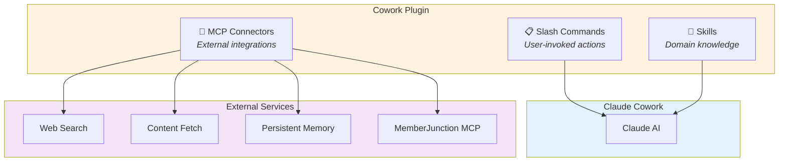
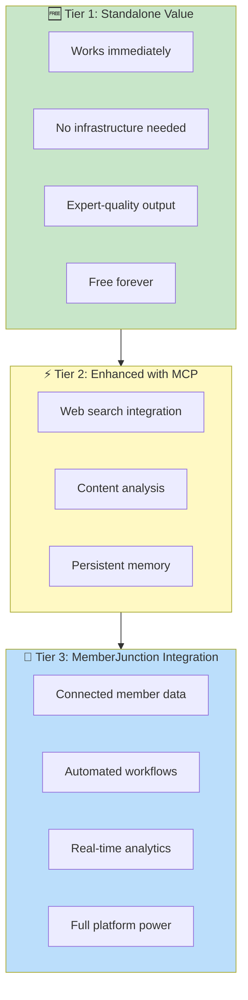

# MemberJunction Cowork Plugins

**AI-powered tools for associations, developers, and the communities they serve.**

[](https://github.com/MemberJunction/MJ)
[](https://opensource.org/licenses/ISC)

---

## Our Mission

We believe that **every association deserves access to expert-level tools**, regardless of their size or budget. Trade associations, professional societies, chambers of commerce, and nonprofit organizations do vital work connecting communities, advancing professions, and advocating for important causes.

This repository provides **free, open-source Claude Cowork plugins** that encode decades of association management best practices into AI-powered tools anyone can use. No infrastructure required. No vendor lock-in. Just immediate value.



---

## Available Plugins

| Plugin | Description | Status |
|--------|-------------|--------|
| [**Association Management**](./association-management/) | 16 commands + 12 skills for trade associations, professional societies, chambers of commerce, and nonprofits | ✅ Ready |
| **MJ Admin/Developer** | Tools for MemberJunction developers - entity queries, migrations, codegen | 🚧 Planned |
| **MJ Agent Builder** | Create, test, and iterate on MJ AI agents through Cowork | 🚧 Planned |

---

## Architecture

Each plugin follows the Claude Cowork standard structure with **no runtime code and no build steps**:

```
plugin-name/
├── .claude-plugin/
│   └── plugin.json      # Plugin metadata and configuration
├── .mcp.json            # MCP server integrations
├── commands/            # Slash commands (user-invoked actions)
│   ├── command-one.md
│   └── command-two.md
├── skills/              # Domain knowledge (markdown expertise)
│   ├── skill-one.md
│   └── skill-two.md
└── README.md            # Plugin documentation
```



---

## Getting Started

### 1. Install a Plugin

In Claude Cowork, add the plugin from this repository:

```
https://github.com/MemberJunction/co-work-plugins/association-management
```

### 2. Use Slash Commands

Invoke commands directly in your conversation:

```
/member-onboarding corporate --tier=premium --industry=healthcare

/board-prep regular --date="2024-03-15" --format=hybrid

/event-planning annual-conference --scale=large --budget="$500k"
```

### 3. Leverage Domain Expertise

The plugin's skills automatically inform Claude's responses with association management best practices, governance frameworks, and industry knowledge.

---

## The Value Ladder

Our plugins are designed with a **tiered value approach**:



**Start free. Grow when ready.**

---

## Why We Built This

Associations operate at the intersection of community, commerce, and cause. They:

- **Connect** professionals and businesses with peers and opportunities
- **Educate** through certifications, conferences, and professional development
- **Advocate** for industries and professions at all levels of government
- **Set Standards** that ensure quality and safety across industries
- **Build Community** that supports careers and advances fields

Yet many associations struggle with limited staff, tight budgets, and overwhelming demands. We built these plugins to **democratize access to expert-level association management tools**.

---

## About MemberJunction

These plugins are created by **[MemberJunction](https://github.com/MemberJunction/MJ)**, an open-source, metadata-driven application development platform designed for associations and member-based organizations.

MemberJunction provides:
- 🏗️ **Unified Data Platform** - 100+ TypeScript packages for modern association technology
- 🤖 **AI Integration** - 15+ AI provider support with sophisticated agent framework
- 📊 **Metadata-Driven** - Auto-generated APIs, forms, and documentation
- 🔌 **MCP Server** - Model Context Protocol integration for AI tool access

**[Explore MemberJunction →](https://github.com/MemberJunction/MJ)**

---

## Contributing

We welcome contributions from the association community! Whether you're an association professional with domain expertise or a developer who wants to improve the tools, there are many ways to help:

- **Add new commands** for common association tasks
- **Enhance skills** with deeper domain knowledge
- **Report issues** and suggest improvements
- **Share use cases** and success stories

See our [Contributing Guide](./CONTRIBUTING.md) for details.

---

## License

This project is licensed under the **ISC License** - see the [LICENSE](./LICENSE) file for details.

---

## Acknowledgments

- **[ASAE](https://www.asaecenter.org/)** - For decades of association management research and best practices
- **[Anthropic](https://www.anthropic.com/)** - For Claude and the Cowork platform
- **The Association Community** - For the inspiration to build these tools

---

<p align="center">
  <b>Built with ❤️ for the association community</b><br/>
  <a href="https://github.com/MemberJunction/MJ">MemberJunction</a> ·
  <a href="https://github.com/MemberJunction/co-work-plugins/issues">Issues</a> ·
  <a href="https://github.com/MemberJunction/co-work-plugins/discussions">Discussions</a>
</p>
